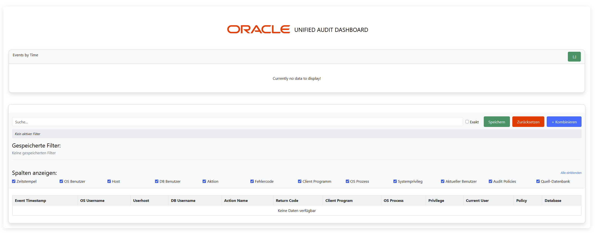

# Unified Audit Dashboard

Welcome to the Unified Audit Dashboard!  
This project provides a clean, modern web interface to view and filter audit data from an Oracle database.

> **Note:**  
> This project was created with the help of GPT (AI-supported prompting and development).  
> Despite this assistance, completing it still took quite a bit of time — because even AIs aren't perfect! 😉  
> This dashboard is provided as a pure hobby project **without any warranty or official support**.  
> Suggestions, issues, and merge requests are very welcome, but please understand that I maintain this project in my free time.  
> Everyone is encouraged to adapt and modify the code to fit their own needs!

---

## Preview

Update: Day-to-Hour Filtering!

## Project Structure

Below is an overview of the most important files and their roles:

| File | Purpose |
|:---|:---|
| **filtertable.js** | Functions to filter the table data dynamically based on user input. |
| **linechart.js** | Setup and rendering logic for the line chart visualization. |
| **piechart.js** | Setup and rendering logic for the pie chart visualization (similar to linechart.js). |
| **sidebar.js** | Initialization and control of the sidebar interface (similar to linechart.js). |
| **main.js** | Main JavaScript functions that control the webpage (excluding direct HTML or PHP operations). |
| **db_queries.php** | Contains all database queries and access logic. |
| **fetch_session.php** | Handles fetching and validating the user session status. |

---

## License

This project is licensed under the **MIT License**.  
You are free to use, modify, and distribute the code, with appropriate attribution.

---

## Support

If you find this project helpful and would like to support it:

☕ [Buy me a coffee](https://buymeacoffee.com/denniskolpatzki)  
💸 [Donate via PayPal](https://paypal.me/MindFck)

Thank you for supporting open-source and hobby-driven projects! ❤️

---

## Disclaimer

This software is provided "as is", without warranty of any kind, express or implied,  
including but not limited to the warranties of merchantability, fitness for a particular purpose, and noninfringement.  
In no event shall the authors be liable for any claim, damages, or other liability, whether in an action of contract, tort, or otherwise, arising from, out of, or in connection with the software or the use or other dealings in the software.

---
(c) 2025 [Dennis Kolpatzki] ([github.com/k0lp4tzki](https://github.com/k0lp4tzki))
